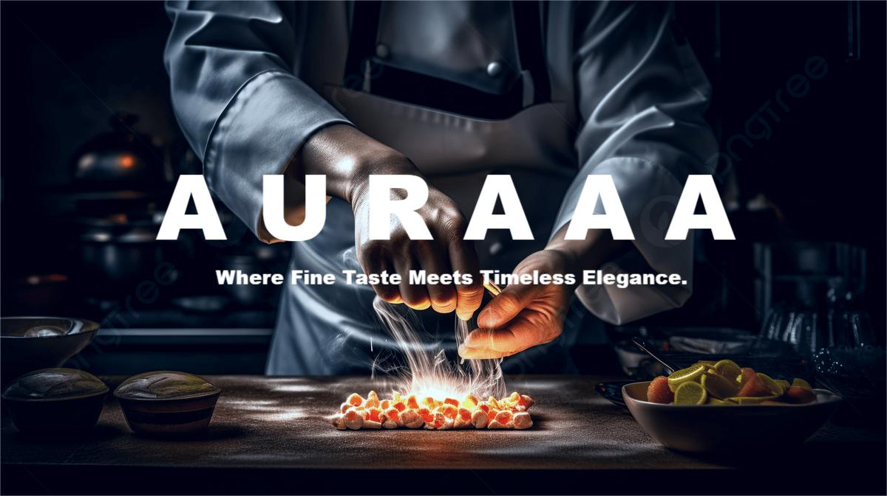
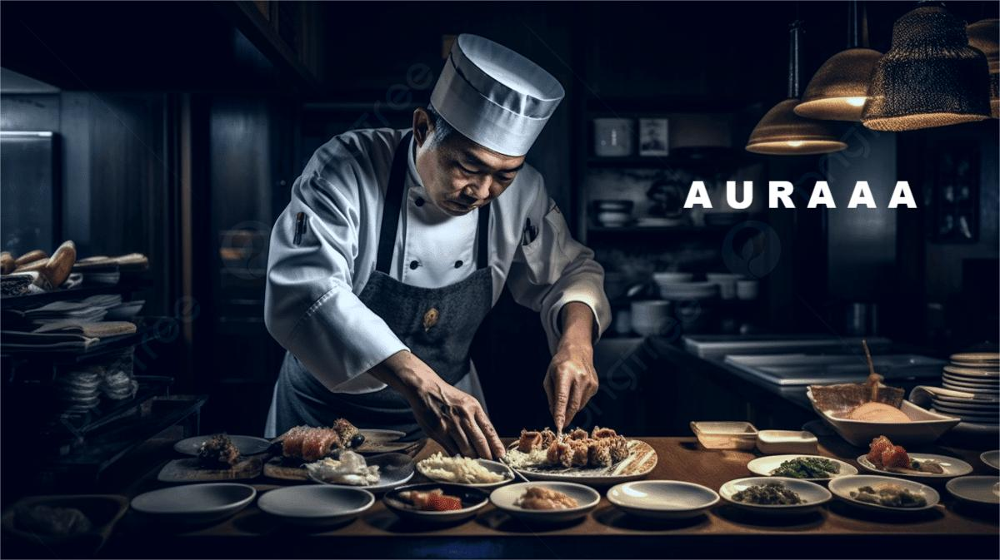
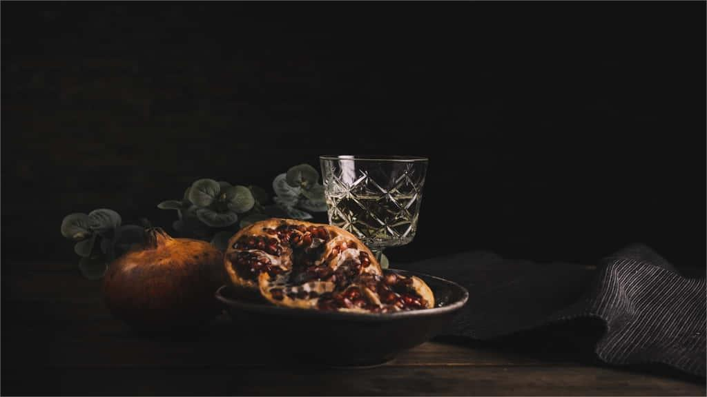

# Auraaa - Restaurant Website

A responsive restaurant website built using HTML, CSS, and Bootstrap.

## 🚀 Features
- Responsive design
- Menu and food sections
- Image gallery
- Contact/reservation section

## 🛠 Tech Stack
- HTML
- CSS
- Bootstrap

## 📂 Project Structure
- HTML pages for navigation
- CSS for styling
- Images for UI design

## 📸 Screenshots

## ▶️ How to Run
1. Download or clone the repo
2. Open index.html in browser

## 👨‍💻 Author
Manikantasai Gollapally
